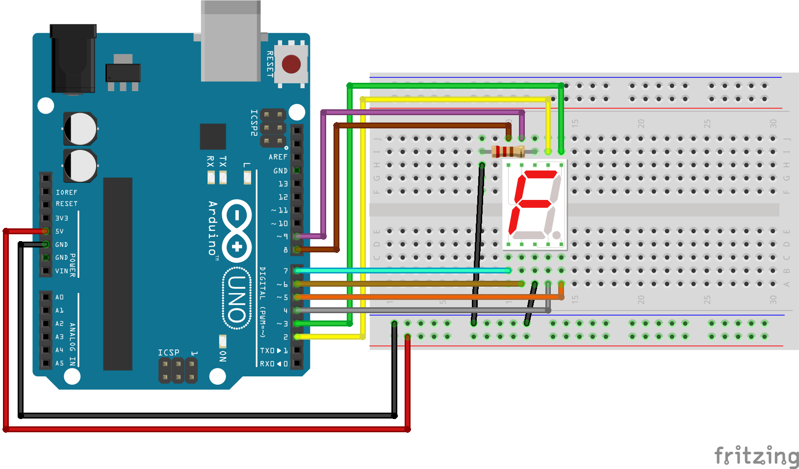

# 7 segments



``` cpp
byte digits[10][8] = {
    //a  b  c  .  d  e  f  g
    { 1, 1, 1, 1, 1, 1, 1, 0},  // for displaying 0
    { 0, 1, 1, 1, 0, 0, 0, 0},  // for displaying 1
    { 1, 1, 0, 1, 1, 1, 0, 1},  // for displaying 2
    { 1, 1, 1, 1, 1, 0, 0, 1},  // for displaying 3
    { 0, 1, 1, 1, 0, 0, 1, 1},  // for displaying 4
    { 1, 0, 1, 1, 1, 0, 1, 1},  // for displaying 5
    { 0, 0, 1, 1, 1, 1, 1, 1},  // for displaying 6
    { 1, 1, 1, 1, 0, 0, 0, 0},  // for displaying 7
    { 1, 1, 1, 1, 1, 1, 1, 1},  // for displaying 8
    { 1, 1, 1, 1, 0, 0, 1, 1},  // for displaying 9
};

void setup() {
    for(int i=2; i<10; i++){
        pinMode(i, OUTPUT);
    }
}
void loop() {
    //displayDigit(1);
    delay(3000);
    for (int i=0;i<10;i++) {
        delay(1000);
        displayDigit(i);
    }
}

void displayDigit(int num){
    int pin = 2;
    for(int i=0; i<8; i++){
        digitalWrite(pin+i, digits[num][i]);
    }
}
```